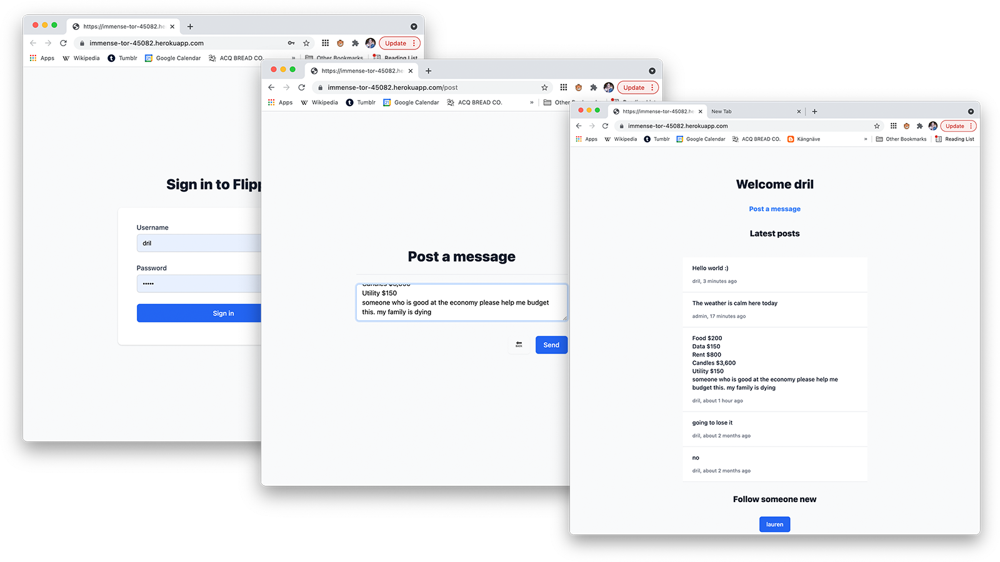

# micro-blog
A microblogging application built with node, redis, tailwindcss, and pug templates.  Loosely inspired by the well known bird website.

## instructions

Usage is very simple.  To create an account, enter a username and password at the login form.  Choose some other accounts to follow from the table at the bottom of your feed, or begin posting yourself!
